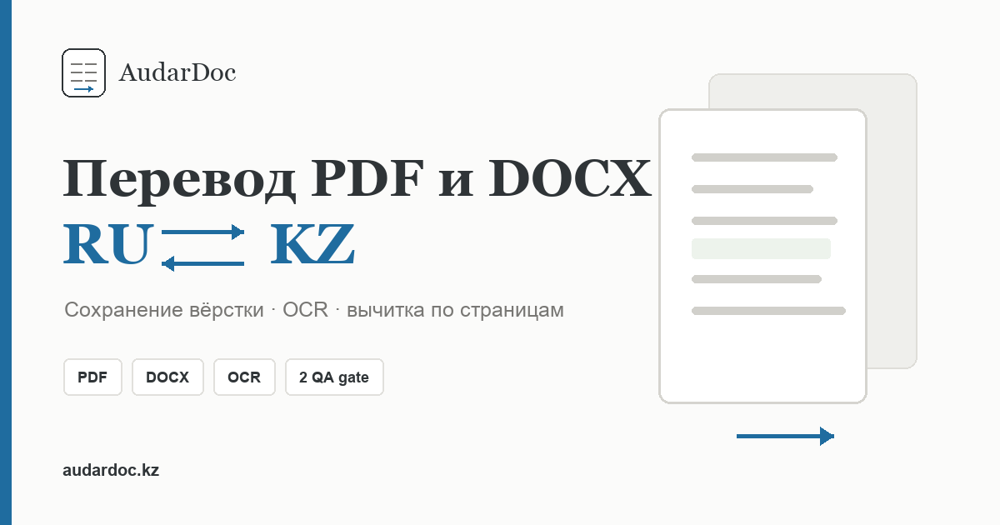
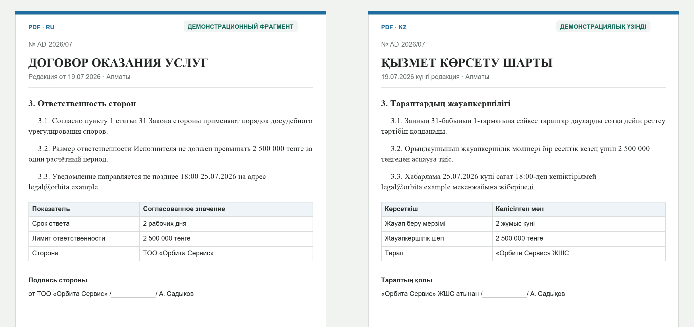
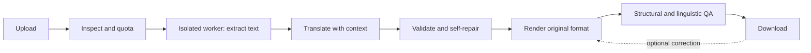

  

# AudarDoc

**Document translation between Russian and Kazakh that keeps the original layout.**

AudarDoc takes a PDF, DOCX or XLSX, translates it, checks its own work, and returns a file in the original format with the tables, images and page structure in place. I designed and built it alone. It runs in a closed, invite-only beta at [audardoc.kz](https://audardoc.kz).

> This repository is a showcase. The source code is private; what follows describes how the system works and what it took to build.

*Synthetic demonstration document, no customer data. Left: Russian source. Right: Kazakh output.*

## What makes it hard

Machine translation produces fluent text. In a contract, fluent is not enough: a wrong amount, a dropped "not", or a swapped clause reference is a real error that reads perfectly well. Kazakh text also runs longer than Russian, so a translation printed into the original text boxes either shrinks or overlaps its neighbours.

AudarDoc addresses both with ordinary code around the model, not trust in the model.

## How a document moves through the system

1. **Inspect.** The API checks size, access and quota, and runs a preflight that never calls the language model.
2. **Extract.** An isolated worker parses the file and returns the visible text as bounded segments. Scans go through OCR.
3. **Translate.** The API detects the document profile and adds document context, private translation memory and curated terminology.
4. **Validate and repair.** Validators check every segment. Failing segments are repaired, then document-level inconsistencies are repaired.
5. **Render.** The worker rebuilds the PDF, DOCX or XLSX and runs structural checks on the finished file.
6. **Deliver.** The user downloads the result, and can correct a fragment and re-render without a full re-translation.

## Validation and self-repair

The validators cover numbers, dates, amounts, identifiers, negation, modality, binding terminology, repeated passages, references, article and clause roles, and the order of details in signature blocks.

A segment that fails goes back to the model with its previous attempt and the specific findings. Candidates are scored by the same validators, and **a repair is accepted only if it scores better than what it replaces**. Segments that passed are not touched.

## PDF re-layout engine

On a 158-page illustrated manual, the first renderer, which printed translations into the source text boxes, produced new text-on-text overlap on 34 pages and text below 5.9 pt on 91 pages.

The second engine pins only artwork, page furniture, codes and page numbers. Body text flows through the measured free space, overflow creates a continuation page, and tables are rebuilt as grids with merged cells and growing rows. The output stores a page map from each source page to its output pages, which the structural checks and the editor both use.

## Isolation and security

Uploaded files are untrusted input.

- Parsing, OCR, conversion and rendering run in a separate worker container that holds no model keys, mail credentials, account or billing secrets, translation memory or persistent customer data.
- The API re-validates everything the worker returns: manifest types and sizes, PDF structure and page count, DOCX and XLSX package safety.
- Hostile fixtures, including malformed files, zip bombs, active content and XXE, are part of the test suite.
- The public configuration fails closed: the service does not start without the isolated worker.

## Testing and operations

- More than 1,000 automated tests run in GitHub Actions on Python 3.11, 3.12 and 3.13, together with container builds.
- A two-hour soak run on the hosting platform covered PDF, OCR and DOCX in both directions, queue overflow, a worker outage with recovery, and an API restart.
- A human comparison against a professional translation bureau confirmed completeness, terminology and structure. It also found three classes of legal-language errors; each is now pinned by a regression test that blocks delivery.

## Formats

| Input | Handling |
|---|---|
| PDF (text, scanned, mixed) | Vector extraction or OCR, then re-layout |
| DOCX | Styles, tables, sections, headers, footers and media preserved |
| XLSX | Cell text translated; formulas, sheets, charts and pivot tables untouched |
| DOC, RTF, ODT, XLS, ODS | Converted to DOCX or XLSX first |

## Limits

The beta runs as a single writable instance on SQLite with files on a volume. Scaling out would need PostgreSQL, object storage and a durable queue. Automated checks reduce errors; they do not replace a certified human translation, and AudarDoc does not claim to.

## Stack

Python, FastAPI, OpenAI API, PyMuPDF, python-docx, lxml, Tesseract OCR, LibreOffice, SQLite, Docker, GitHub Actions, Railway, Cloudflare.

## Contact

Amir Buzubayev · [LinkedIn](https://www.linkedin.com/in/amir-buzubayev)

Happy to walk through the code and design decisions in an interview.
